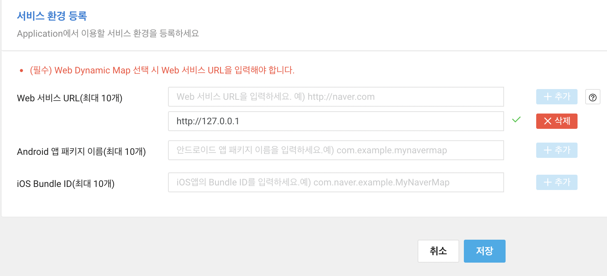

### 네이버 지도 API 이용하기

네이버 지도 API를 이용하기 위해서는 Naver Cloud Platform 회원가입, 결제 수단 등록, 애플리케이션 등록과 같은 과정이 필요하다.

 
Naver Cloud Platform이 상품 소개를 목적으로 운영하는 블로그에서 자세히 가입부터 애플리케이션 등록까지의 과정을 쉽게 따라할 수 있다.

[[상품소개] 네이버 지도 API 사용하기](https://m.blog.naver.com/n_cloudplatform/222012109447)

 

하지만 간단하게 로컬 환경 (개발 환경) 에서 Naver MAP API를 테스트 해보고 싶다면 아래와 같이 서비스 환경을 등록하면 된다.

 

 

여기서 포트 번호를 입력하지 않은 이유는 포트 번호를 입력하게 되면 클라이언트에 다른 프레임워크를 사용하면서 포트 번호가 변경되면 일일히 수정해줘야 한다.

또한 제일 첫 root 페이지에서 사용이 안되는 문제가 있었다. (이건 내 잘못일 수 도 있지만, 예를 들어 `http://127.0.0.1:3000/`에서는 naver api 인증 실패가 나오고 `http://127.0.0.1:3000/main`과 같은 하위 페이지에서는 사용이 가능했다.)

 

어찌 됬건 즐코!